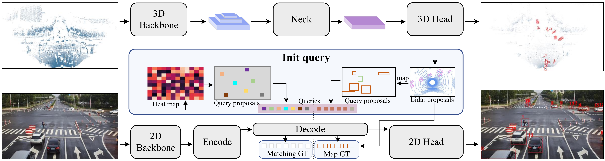

# Towards Consistent Object Detection via LiDAR-Camera Synergy  
This repository contains code for our ***IEEE:SMC 2024***  paper titled ***Towards Consistent Object Detection via LiDAR-Camera Synergy***. 
>**Authors:** Kai Luo* · Hao Wu* · [Kefu Yi](https://www.csust.edu.cn/jtysgcxy/info/1130/17551.htm) · Kailun Yang · Wei Hao · Rongdong Hu .

>**More details on the paper can be found on [Arxiv](https://arxiv.org/pdf/2405.01258).**


## Abstract 📝

As human-machine interaction advances, integrating image and point cloud data enhances detection accuracy. Current models lack the ability to detect object positions in both modalities and establish their correlation. This paper introduces an end-to-end Consistency Object Detection (COD) framework, enabling simultaneous object position detection and correlation in a single inference. A new evaluation metric, Consistency Precision (CP), is proposed to assess correlation accuracy. Experiments on KITTI and DAIR-V2X datasets validate the framework's performance and robustness, particularly under disturbed calibration conditions, outperforming post-processing methods.

##  Pipeline ⚙
<div align=center></div>
The architecture diagram for the consistency detection network. The overall architecture of consistency detection comprises two pathways: the
 point cloud object detection pathway and the image object detection pathway. In the former, point cloud features are extracted through a 3D backbone
 network, transformed via a neck network, and then object positions and dimensions in the point cloud are predicted using a detection head. In the latter,
 features are extracted through a 2D backbone network and processed through the encoder layer of a transformer to generate a heat map, from which query
 proposals are derived. Additional query proposals are obtained using the object positions and dimensions acquired from the point cloud. Both sets of query
 proposals are fed into the decoder layer of the transformer, and the final object positions in the image are obtained via the image’s detection head. Notably,
 during training, the first set of queries is matched with the ground truth to compute loss, while the second set, already corresponding to the ground truth,
 bypasses the matching process and goes directly to loss calculation

##  Get Started 🎯

#### Environment
- PyTorch with CUDA support
- OpenPCDet based environment
- Ultralytics Library


#### Training the model
```bash
./train_local.sh
```

#### Testing the model
```bash
./test_local.sh
```
##  Update 🔄

We will carry out follow-up work according to the following plan:
- [x] 2024.04.30 Init repository.
- [x] 2024.07.11 COD [(PDF)](https://arxiv.org/pdf/2405.01258.pdf) is accepted to SMC2024.
- [x] Upload project source code.
- [ ] Organize project source code.

## License and Citation 📑
The software is licensed under the Apache License 2.0. Please cite the following paper if you have used this code:
```bibtex
@INPROCEEDINGS{luo2024smc,
  title={Towards Consistent Object Detection via LiDAR-Camera Synergy}, 
  booktitle={2024 IEEE International Conference on Systems, Man, and Cybernetics}, 
  author={Luo, Kai and Wu, Hao and Yi, Kefu and Yang, Kailun and Hao, Wei and Hu, Rongdong},
  year={2024}, 
}
```

